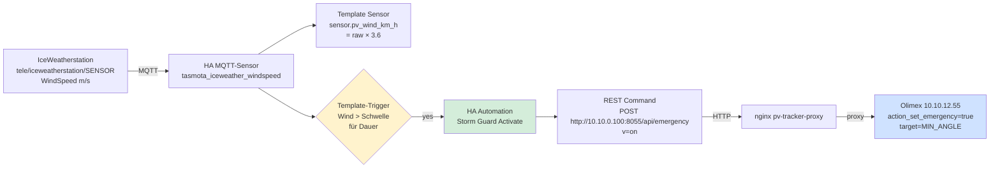
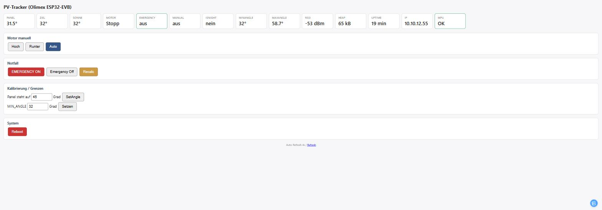
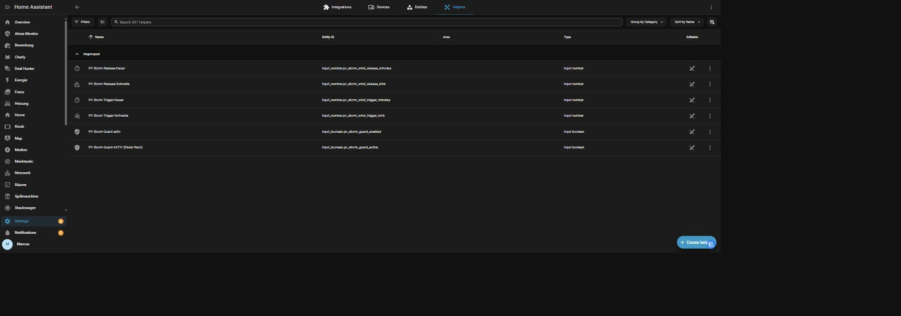
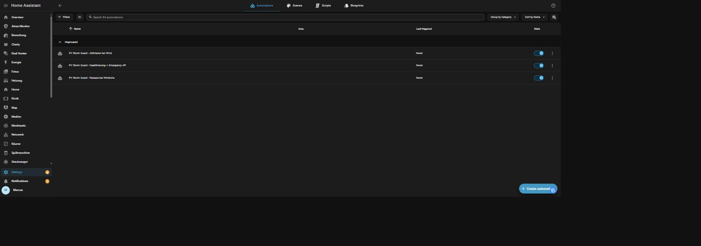
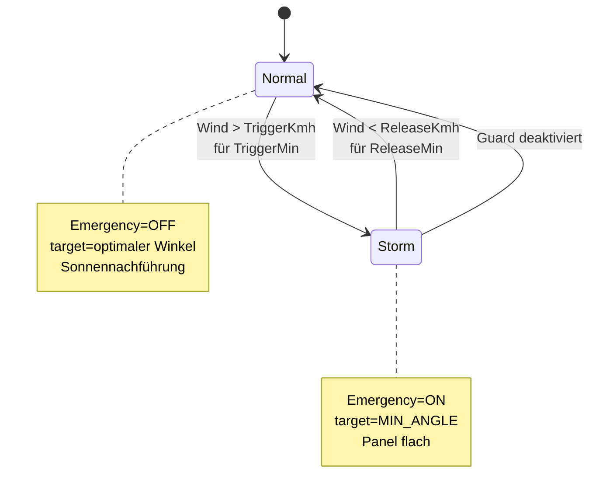

# HA Storm Guard – lokale Wind-Sturm-Automatik

**Status: live deployed und verifiziert (Stand 26.07.2026)**

Ziel: Bei anhaltend hohem Wind an der lokalen Wetterstation wird das PV-Panel automatisch in die Schutzposition (`MIN_ANGLE`, ~32°, flach auf dem Dach) gefahren. Bei anhaltend ruhigem Wind kehrt es zurück in den Auto-Modus. **Komplett in Home Assistant** – der ESP-Controller bleibt firmware-mäßig unverändert.

## Warum ein zweiter Sturmschutz?

Es gibt bereits [einen DWD-basierten Sturmschutz per NodeRED](nodered-stormwatch.md), der offizielle Unwetterwarnungen des Deutschen Wetterdienstes auswertet. Der greift aber nur bei behördlich ausgegebenen Warnungen. Ein lokaler Windstoss von 40 km/h aus einer Gewitterzelle ohne Warnung würde ihn nicht triggern.

Der Storm Guard hier ergänzt das um eine **lokale, sensor-basierte Auslösung**:

| Trigger | Quelle | Latenz | Deckt |
|--------|-------|--------|-------|
| NodeRED-Sturmwatch | DWD Warnstufe + NINA | Minuten | Angekündigte Unwetter |
| **HA Storm Guard** | Lokale Wetterstation `sensor.tasmota_iceweather_windspeed` | ~1 Min | Lokale Windstöße |

Beide setzen dasselbe Ziel: `cmnd/solar/EMERGENCY on` → Panel flach.

## Architektur



**Wichtige Design-Entscheidung – HTTP statt MQTT-Command:** Der `cmnd/solar/EMERGENCY`-MQTT-Sub wird auf dem Olimex zeitweise unzuverlässig (nach MQTT-Reconnects gehen Subscriptions manchmal verloren). Das direkt über HTTP an den `/api/emergency`-Endpoint zu schicken ist zuverlässiger und braucht keine dauerhafte Subscription am Board.

## Olimex WebGUI (unverändert)

Der Tracker selbst zeigt seinen Live-Zustand weiterhin unter `http://<nuc-ha-ip>:8055/`:



Wenn Storm Guard triggert → HA POST an `/api/emergency` → `Emergency` wechselt auf `an`, Target auf MinAngle. Der Reboot-Button rechts unten stammt aus der `/api/reboot`-Ergänzung (commit 65ecf99).

## HA Helpers-Übersicht

Alle 6 Storm-Guard-Helper unter **Settings → Devices & Services → Helpers**:



## HA Automations-Übersicht

Die 3 Storm-Guard-Automations unter **Settings → Automations**:



„Last triggered: Never" bedeutet: der aktuelle Wind (~2 km/h zum Screenshot-Zeitpunkt) hat noch nie den Trigger-Schwellwert erreicht — Storm Guard ist scharf aber schlafend.

## Konfigurierbare Parameter

Alle in HA-UI editierbar unter **Einstellungen → Geräte & Dienste → Helfer**:

| Helper | Default | Bedeutung |
|--------|---------|-----------|
| `input_boolean.pv_storm_guard_enabled` | ON | Master-Schalter – aus = keine Automatik |
| `input_boolean.pv_storm_guard_active` | OFF (auto) | Anzeige: gerade ein Sturm-Guard aktiv? |
| `input_number.pv_storm_wind_trigger_kmh` | 30 | Wind muss darüber gehen |
| `input_number.pv_storm_wind_trigger_minutes` | 1 | ...und mindestens so lange |
| `input_number.pv_storm_wind_release_kmh` | 10 | Wind muss darunter gehen |
| `input_number.pv_storm_wind_release_minutes` | 10 | ...und mindestens so lange |
| `sensor.pv_wind_km_h` | (auto) | Live-Wind in km/h (m/s × 3.6) |

## Zustands-Diagramm



## Home Assistant Package

Das komplette Paket liegt unter `packages/pv_storm_guard.yaml` (relativ zum HA-Config-Verzeichnis, aktiviert über `packages: !include_dir_named packages/`).

```yaml
# =============================================================================
# PV STORM GUARD - HA-seitige Wind-Sturm-Automatik fuer den Solar-Tracker
# =============================================================================
input_number:
  pv_storm_wind_trigger_kmh:
    name: "PV Sturm Trigger-Schwelle"
    min: 5
    max: 100
    step: 1
    initial: 30
    unit_of_measurement: "km/h"
    icon: mdi:weather-windy

  pv_storm_wind_release_kmh:
    name: "PV Sturm Release-Schwelle"
    min: 0
    max: 50
    step: 1
    initial: 10
    unit_of_measurement: "km/h"
    icon: mdi:weather-partly-cloudy

  pv_storm_wind_trigger_minutes:
    name: "PV Sturm Trigger-Dauer"
    min: 1
    max: 30
    step: 1
    initial: 1
    unit_of_measurement: "min"

  pv_storm_wind_release_minutes:
    name: "PV Sturm Release-Dauer"
    min: 1
    max: 60
    step: 1
    initial: 10
    unit_of_measurement: "min"

input_boolean:
  pv_storm_guard_enabled:
    name: "PV Sturm-Guard aktiv"
    icon: mdi:shield-check
  pv_storm_guard_active:
    name: "PV Sturm-Guard AKTIV (Panel flach)"
    icon: mdi:shield-alert

template:
  - sensor:
      - name: "PV Wind km/h"
        unique_id: pv_wind_kmh
        state: >-
          {{ (states('sensor.tasmota_iceweather_windspeed') | float(0) * 3.6) | round(1) }}
        unit_of_measurement: "km/h"
        icon: mdi:weather-windy

rest_command:
  solar_emergency_on:
    url: "http://10.10.0.100:8055/api/emergency"
    method: POST
    content_type: "application/x-www-form-urlencoded"
    payload: "v=on"
    timeout: 8

  solar_emergency_off:
    url: "http://10.10.0.100:8055/api/emergency"
    method: POST
    content_type: "application/x-www-form-urlencoded"
    payload: "v=off"
    timeout: 8

automation:
  - id: pv_storm_guard_activate
    alias: "PV Storm Guard - Aktivieren bei Wind"
    mode: single
    trigger:
      - platform: template
        value_template: >-
          {{ (states('sensor.tasmota_iceweather_windspeed') | float(0))
             > (states('input_number.pv_storm_wind_trigger_kmh') | float(30) / 3.6) }}
        for:
          minutes: "{{ states('input_number.pv_storm_wind_trigger_minutes') | int(1) }}"
    condition:
      - condition: state
        entity_id: input_boolean.pv_storm_guard_enabled
        state: "on"
      - condition: state
        entity_id: input_boolean.pv_storm_guard_active
        state: "off"
    action:
      - service: rest_command.solar_emergency_on
      - service: input_boolean.turn_on
        target:
          entity_id: input_boolean.pv_storm_guard_active
      - service: logbook.log
        data:
          name: "PV Storm Guard"
          message: >-
            AKTIVIERT - Wind {{ states('sensor.pv_wind_km_h') }} km/h ueber
            {{ states('input_number.pv_storm_wind_trigger_kmh') }} km/h fuer
            {{ states('input_number.pv_storm_wind_trigger_minutes') }} min

  - id: pv_storm_guard_release
    alias: "PV Storm Guard - Release bei Windruhe"
    mode: single
    trigger:
      - platform: template
        value_template: >-
          {{ (states('sensor.tasmota_iceweather_windspeed') | float(999))
             < (states('input_number.pv_storm_wind_release_kmh') | float(10) / 3.6) }}
        for:
          minutes: "{{ states('input_number.pv_storm_wind_release_minutes') | int(10) }}"
    condition:
      - condition: state
        entity_id: input_boolean.pv_storm_guard_active
        state: "on"
    action:
      - service: rest_command.solar_emergency_off
      - service: input_boolean.turn_off
        target:
          entity_id: input_boolean.pv_storm_guard_active

  - id: pv_storm_guard_disabled_cleanup
    alias: "PV Storm Guard - Deaktivierung -> Emergency off"
    mode: single
    trigger:
      - platform: state
        entity_id: input_boolean.pv_storm_guard_enabled
        to: "off"
    condition:
      - condition: state
        entity_id: input_boolean.pv_storm_guard_active
        state: "on"
    action:
      - service: rest_command.solar_emergency_off
      - service: input_boolean.turn_off
        target:
          entity_id: input_boolean.pv_storm_guard_active
```

## Test-Kommandos

Kann jederzeit manuell getriggert werden ohne auf Wind zu warten:

```bash
# HA-Token setzen
TOKEN="..."

# Emergency ON per REST-Command
curl -X POST -H "Authorization: Bearer $TOKEN" \
  http://10.10.10.100:8123/api/services/rest_command/solar_emergency_on -d '{}'

# Status prüfen am Olimex direkt
curl -s http://10.10.0.100:8055/api/state | jq '.SENSOR.Emergency'
# → true

# Zurückstellen
curl -X POST -H "Authorization: Bearer $TOKEN" \
  http://10.10.10.100:8123/api/services/rest_command/solar_emergency_off -d '{}'
```

## Debugging

**Storm Guard reagiert nicht auf Wind?**

1. `sensor.tasmota_iceweather_windspeed` — hat der Werte? (`< 30 s` alt)
2. `input_boolean.pv_storm_guard_enabled` — ist auf ON?
3. Manueller Test: REST-Command wie oben triggern — kommt Emergency auf true?
4. HA-Log filtern nach `pv_storm_guard`
5. `sensor.pv_wind_km_h` — zeigt einen sinnvollen Wert?

**Panel geht nicht flach obwohl Emergency=true?**

1. `sensor.solartracker_target_angle` — sollte auf MIN_ANGLE stehen
2. Aktuator-Sicherung/Verkabelung prüfen
3. MPU-Status prüfen: `curl http://10.10.0.100:8055/api/state | jq .SENSOR.MpuOk`

## Bezug zu anderen Komponenten

- **[NodeRED Storm Watch](nodered-stormwatch.md)** – DWD-basiert, ergänzt Storm Guard um behördliche Warnungen
- **[Hardware Migration ESP32-EVB](hardware-migration-esp32-evb.md)** – Firmware-Basis auf Olimex
- **[MQTT-Topics](mqtt.md)** – bestehende cmnd/tele-Struktur (Storm Guard nutzt HTTP-API statt Command-Topic)
