# Hardware-Migration: ESP12F-Relay-X4 v1.2 → Olimex ESP32-EVB-EA Rev.L

Diese Doku beschreibt den Umbau des Solar-Tracker-Controllers vom ESP8266-basierten
**ESP12F-Relay-X4 v1.2** auf den ESP32-basierten **Olimex ESP32-EVB-EA Rev.L** mit
externer WLAN-Antenne. Ziel: mehr RAM, robusteres WLAN am schlechten Empfangsort
(Schuppen), OTA-Fähigkeit.

> → Alle vier Schaltbilder kompakt auf einer Seite: [Wiring-Übersicht ESP32-EVB](wiring-esp32-evb.html)

> **TL;DR** — Ihr könnt das alte Board 1:1 tauschen, müsst aber die **12 V-Zuleitung
> umkonzepieren**: das neue Board ist strikt 5 V. Nötig sind zusätzlich ein
> Mini-360 Step-Down und eine WAGO-T-Verzweigung.

## Warum tauschen

| Aspekt | ESP12F-Relay-X4 (alt) | Olimex ESP32-EVB-EA (neu) |
|---|---|---|
| MCU | ESP8266 @ 80/160 MHz | ESP32 dual-core @ 240 MHz |
| RAM | ~36 KB | 520 KB |
| Flash | 4 MB | 4 MB |
| WLAN-Antenne | PCB (auf ESP-12F) | externe IPEX + Stab-Antenne |
| Firmware-Form | `.mpy` (RAM-Druck) | `.py` direkt |
| OTA möglich | nein | ja |
| Crash-Profil | gelegentliche Heap-Crashes | nur noch Software-Bugs realistisch |

## Big Picture: alle Anschlüsse im Vergleich

| Aspekt | ALT – ESP12F-Relay-X4 v1.2 | NEU – Olimex ESP32-EVB-EA |
|---|---|---|
| Board-Stromversorgung | 12 V direkt an VIN-Klemme (Board hat eigenen Buck 12→5→3.3 V) | **Nur 5 V zulässig!** → Mini-360 Buck extern, dann DC-Jack 5.5×2.1 mm (Mitte +) |
| Aktuator-Versorgung | 12 V+ auf K1-COM, 12 V− auf K2-COM (vom Board-Vin abgezweigt) | 12 V+ auf REL1-COM, 12 V− auf REL2-COM (per WAGO parallel zur 5-V-Erzeugung) |
| Relais-Steuerung | GPIO16 (K1 = Runter), GPIO14 (K2 = Hoch) | GPIO32 (REL1 = Runter), GPIO33 (REL2 = Hoch) |
| I²C SDA | GPIO4 (D2) | GPIO13 = UEXT Pin 6 (Pull-up onboard) |
| I²C SCL | GPIO5 (D1) | GPIO16 = UEXT Pin 5 (Pull-up onboard) |
| MPU-6050 Versorgung | 3V3 + GND vom Board | 3V3 + GND aus UEXT Pin 1 / Pin 2 |
| Trenn-Bauteil dazwischen | keins nötig | **Mini-360 Step-Down** + **WAGO 221 T-Verzweigung** |

## Diagramm 1 — IST-Zustand ESP12F-Relay-X4



Der Boardregler zieht die 12 V selbst herunter, Relais K1/K2 schalten die
Aktuator-Adern in Polaritätsumkehr.

## Diagramm 2a — SOLL-Zustand Power-Pfad



Die 12 V-Zuleitung wird an einer WAGO 221 T-Verzweigung aufgeteilt:

- **Zweig A (Logik)**: 12 V → Mini-360 → getrimmt auf exakt 5.0 V → DC-Hohlstecker 5.5 × 2.1 mm (Mitte +) → Olimex DC-Jack → onboard TPS62A02 → 5 V / 3.3 V Rails.
- **Zweig B (Last)**: 12 V+ direkt an REL1-COM, 12 V− direkt an REL2-COM.

Gemeinsame Masse ist automatisch, weil beide Zweige aus derselben 12 V-Quelle kommen.

## Diagramm 2b — SOLL-Zustand Signal-/Last-Pfad



Olimex steuert die zwei Onboard-Relais REL1/REL2 (GPIO32/33), die Aktuator-Adern
hängen in Polarity-Reverse-Verdrahtung an NO/NC. MPU-6050 hängt komplett am
UEXT-Stecker (Pin 1/2/5/6).

## Diagramm 3 — Klemmen-Detail



Farbcode: rot = 12 V+, blau = 12 V−, gelb = 5 V, grün = Aktuator-Last.

## Stromversorgung Olimex — Warum kein 12 V direkt

Der onboard Buck-Regler des Olimex ESP32-EVB-EA ist ein **TPS62A02** mit
**Vin 2.5–5.5 V typ., abs. Max 6.5 V**. Alles darüber killt den Regler sofort.

Referenzen (offizielle Olimex-Doku):

- [ESP32-EVB Rev.L KiCad-Schaltplan (PDF)](https://github.com/OLIMEX/ESP32-EVB/blob/master/HARDWARE/REV-L/ESP32-EVB_Rev_L.pdf)
- [ESP32-EVB User Manual (PDF)](https://github.com/OLIMEX/ESP32-EVB/blob/master/DOCS/ESP32-EVB-user-manual.pdf)
- [TI TPS62A02 Datenblatt](https://www.ti.com/product/TPS62A02A)

### Was am Olimex **nicht** geht

- 12 V an DC-Jack — zerstört den TPS62A02.
- 12 V an EXT/UEXT Pin 1 — das ist der 5-V-Rail-Ausgang, kein Input.
- 12 V an die Schraubklemmen des Boards — die sind Relais-Kontakte (COM/NO/NC), keine Versorgung.
- PoE über RJ45 — der EVB hat keine PoE-PHY (das ist die separate `ESP32-POE`-Variante).

### Was geht

1. **DC-Jack 5.5 × 2.1 mm, Mitte +**, gespeist aus Mini-360-VOUT — cleanster Weg, Reverse-Polarity-Diode auf dem Board schützt.
2. **Micro-USB**, gespeist aus 5-V-USB-Netzteil oder Mini-360 + aufgetrenntes USB-Kabel — genauso sicher, mechanisch etwas fragiler.
3. **LiPo-Header** JST-PH 2 mm (`BAT1`) — nur wenn Batterie geplant.

### Auslegung Mini-360

| | |
|---|---|
| Last (Olimex + CH340 + MPU + 2 Relais-Spulen) | ~450 mA @ 5 V ≈ 2.25 W |
| Mini-360 max dauerhaft | 1.8 A → >4-fache Reserve |
| Wärme im geschlossenen Gehäuse | Handwarm; bei Bedenken: LM2596 mit Kühlkörper oder Traco TSR-1-2450 |

## Verkabelung Motor (Polarity-Reverse-Pattern)

Die zwei externen Relais des alten Aufbaus entfallen komplett — die Motor- und
Power-Adern gehen direkt in die Schraubklemmen der zwei Onboard-Relais des Olimex.

| Funktion | ALT – ESP12F-Relay-X4 | NEU – Olimex ESP32-EVB-EA |
|---|---|---|
| Motor „Runter" Steuerung | GPIO16 → K1-Spule (Board-intern) | GPIO32 (REL1) – onboard |
| Motor „Hoch" Steuerung | GPIO14 → K2-Spule (Board-intern) | GPIO33 (REL2) – onboard |
| Aktuator + | K1-NO | **REL1-NO + REL2-NC** |
| Aktuator − | K2-NO | **REL2-NO + REL1-NC** |
| 12 V + | K1-COM | **REL1-COM** |
| 12 V − | K2-COM | **REL2-COM** |

**Wenn Motorrichtung verkehrt**: entweder `PIN_RELAY1` / `PIN_RELAY2` in `env.py`
tauschen ODER Aktuator-Adern mechanisch in den Klemmen kreuzen — nicht beides.

## Verkabelung MPU-6050 an UEXT

Alle vier Adern gehen in den 10-pol IDC-UEXT-Stecker. Kein Löten nötig.

| MPU-6050 | ALT – ESP12F-Relay-X4 | NEU – Olimex UEXT (10-pol IDC) |
|---|---|---|
| VCC | 3V3 Stiftleiste | **UEXT Pin 1 (+3.3 V)** |
| GND | GND Stiftleiste | **UEXT Pin 2 (GND)** |
| SCL | GPIO5 (D1) | **UEXT Pin 5 → GPIO16** (Pull-up onboard) |
| SDA | GPIO4 (D2) | **UEXT Pin 6 → GPIO13** (Pull-up onboard) |
| AD0 | an GND (Adr. 0x68) | an GND (unverändert) |

UEXT-Pinout (Sicht von oben aufs Board, Pin 1 markiert):

```
   1 +3.3V    2 GND
   3 TXD      4 RXD
   5 SCL      6 SDA    ←── MPU-6050 hier
   7 MISO     8 MOSI
   9 SCK     10 SS
```

## Zusätzliche Bauteile

| Menge | Bauteil | Zweck | Bezug (Beispiel) |
|---|---|---|---|
| 1 | **Olimex ESP32-EVB-EA Rev.L** | neuer Controller | [olimex.com](https://www.olimex.com/Products/IoT/ESP32/ESP32-EVB/) ~20 € |
| 1 | **Mini-360** DC-DC-Buck (alternativ LM2596 mit Kühlkörper) | 12 V → 5.0 V für Olimex-Logik | Amazon 8er-Set ~8 € |
| 1 | **DC-Hohlstecker 5.5 × 2.1 mm, Mitte +**, zum Anlöten | Mini-360 → Olimex DC-Jack | Amazon / Reichelt |
| 2 | **WAGO 221** (3-Leiter) | T-Verzweigung 12 V+ und 12 V− | Baumarkt |
| 1 | **UEXT-IDC-Ribbon-Kabel 10-pol** (2×5, 2.54 mm, IDC-Buchse mit Codierung) | MPU-6050 an UEXT | Amazon (siehe unten) |
| — | 0.75 mm² / 1.5 mm² Kabel, Aderendhülsen | Verlängerung zu WAGO | Vorrat |
| — | Multimeter | Mini-360 auf 5.00 V trimmen | Vorrat |

## Werkbank-Checkliste

- [ ] Strom AUS am alten Solar-Tracker-Standort (12 V-Netzteil ausstecken)
- [ ] Antenne am Olimex: IPEX-Pigtail eingerastet + SMA-Stab aufgeschraubt (**VOR** Power-On!)
- [ ] Mini-360 auf der Werkbank auf **5.00 V trimmen** (Multimeter am Ausgang, ohne Olimex angeschlossen)
- [ ] WAGO 221 A (12 V+): 12 V+ vom Netzteil rein, 2 Leiter raus (zu Mini-360-VIN+ und zu REL1-COM)
- [ ] WAGO 221 B (12 V−): 12 V− vom Netzteil rein, 2 Leiter raus (zu Mini-360-VIN− und zu REL2-COM)
- [ ] DC-Hohlstecker: Mini-360-VOUT+ auf Innen-Pin, VOUT− auf Ring, in Olimex-DC-Jack
- [ ] Aktuator-Adern beim Erstboot noch ABGEKLEMMT lassen (GPIO32/33 wackeln kurz beim Boot)
- [ ] MPU-6050 4-adrig am UEXT-Stecker (Pin 1/2/5/6)
- [ ] 12 V-Netzteil einstecken → Olimex-LEDs an, Mini-360-LED an
- [ ] Nachmessen: DC-Jack-Eingang am Olimex zeigt 5.0 V (± 0.1)
- [ ] Aktuator-Adern in REL1/REL2-Klemmen gemäß Polarity-Reverse-Schema (Diagramm 3)
- [ ] Firmware-Deployment: `env.py`, `boot.py`, `main.py`, `mpu6050.py`, `solar_main.py` via `mpremote`
- [ ] Reset + MQTT-Test
- [ ] Motorrichtung OK? Falls nicht: PIN_RELAY1/2 in env.py tauschen ODER Aktuator-Adern kreuzen
- [ ] WLAN-RSSI prüfen — Erwartung ≥ −65 dBm mit externer Antenne

## Sicherheits-Reminder

- **Nie 12 V direkt** in irgendeinen Anschluss des Olimex.
- **Nie ohne Antenne** einschalten, wenn WLAN-Betrieb geplant ist (HF-Reflexion → Modul-Schaden).
- Mini-360-Poti **nie unter Last** verstellen (Overshoot möglich).
- Motor-Adern beim Erstboot **abklemmen** (Boot-Klick der Relais).
- **Keine 230 V** auf die Olimex-Relais — der Aufbau ist mechanisch nicht dafür isoliert.

## Firmware-Änderungen

Zur ESP8266→ESP32-Portierung sind minimale Code-Anpassungen nötig:

- **Firmware-Flash-Offset**: `0x1000` (statt `0x0` wie ESP8266).
- **PowerSave**: `sta.config(pm=sta.PM_NONE)` in `boot.py` (statt `esp.sleep_type(esp.SLEEP_NONE)`).
- **Compat-Shim** in `solar_main.py` für `esp.sleep_type()` (no-op auf ESP32).
- Kein `.mpy`-Compile mehr nötig; `solar_main.py` läuft direkt.
- **`init()`-Reihenfolge umgedreht**: WLAN zuerst → MQTT → MPU (optional) → HTTP → WDT. Damit bleibt der Remote-Zugang auch dann garantiert, wenn der MPU-6050 (noch) nicht am UEXT hängt. `sensor = None` sperrt automatisch jegliche Motorbewegung (Sicherheit), Web + MQTT laufen normal weiter und melden `MpuOk:false` inkl. Fehlercode.
- **Watchdog-Timeout: 30 s** (statt fest 3 s wie beim ESP8266) — genug Reserve, damit ein langsamer HTTP-Request keinen falschen Reset auslöst.

Siehe [software.md](software.md) für die generellen Firmware-Details.

## Eingebautes WebGUI + REST-API

Ausreichend RAM auf dem ESP32 (~80 kB frei im Betrieb) macht es möglich, den früher gestrichenen Mini-Webserver wieder mitlaufen zu lassen — nonblocking im Main-Loop, ohne Threads. Aufrufbar direkt unter `http://<esp-ip>/`:

- **Dashboard** (Auto-Refresh alle 4 s): Panel-Winkel, Ziel-Winkel, Sonnen-Winkel, Motorstatus, Emergency/Manual-Flags, WLAN-RSSI, Heap, Uptime, MPU-Status, ggf. LastError.
- **Motor manuell**: Buttons **Hoch / Runter / Auto**.
- **Notfall**: **EMERGENCY ON / OFF** (Panel sofort flach) + **Recalc** (Sonne neu berechnen).
- **Kalibrierung / Grenzen**: Feld für `SetAngle <grad>` (kalibriert den MPU-Offset live und persistiert ihn nach `/calib.json`) + Feld für `MIN_ANGLE` (0–70°).

Alle Aktionen laufen intern über dieselben Helper wie die MQTT-Commands (`action_set_emergency`, `action_manual`, `action_setangle`, `action_recalc`, `action_set_minangle`) — die REST-Endpoints sind ein reiner Alias-Pfad neben dem MQTT-Bus.

### REST-Endpoints

| Methode | Pfad | Payload (form-encoded) | Antwort |
|---|---|---|---|
| `GET` | `/` | — | HTML-Dashboard |
| `GET` | `/api/state` | — | JSON-Snapshot (identisches Schema wie MQTT-Topic `tele/solar/SENSOR`) |
| `POST` | `/api/manual` | `v=up\|down\|auto` | text/plain, z.B. `Manual: Up` |
| `POST` | `/api/emergency` | `v=on\|off` | `Emergency on` / `Emergency off` |
| `POST` | `/api/recalc` | — | `recalc: sun=X target=Y` |
| `POST` | `/api/setangle` | `v=<grad>` | `calib: offset=Z, panel=<grad>` |
| `POST` | `/api/minangle` | `v=<grad>` | `MIN_ANGLE=<grad>` |

Beispiel mit `curl`:

```bash
curl http://10.10.12.55/api/state | jq
curl -X POST -d "v=on"  http://10.10.12.55/api/emergency
curl -X POST -d "v=45"  http://10.10.12.55/api/setangle
```

## Reverse-Proxy für Zugriff aus getrenntem VLAN

Wenn der Tracker in einem isolierten IoT-VLAN sitzt (z.B. Firewall-Regel „nur MQTT + Internet raus"), erreicht euer Client-Netz den Web-Port `:80` nicht direkt. Ein kleiner nginx-Container auf einem Host im Zwischennetz (z.B. der HA-Server) proxied durch:

```nginx
# /etc/nginx/conf.d/pv-tracker.conf
server {
  listen 8055;
  location / {
    proxy_pass http://10.10.12.55;
    proxy_http_version 1.1;
    proxy_set_header Host $host;
    proxy_read_timeout 8s;
  }
}
```

als Docker One-Liner:

```bash
docker run -d --name pv-tracker-proxy --restart unless-stopped \
  -p 8055:80 \
  -v /opt/pv-tracker-proxy/nginx.conf:/etc/nginx/nginx.conf:ro \
  nginx:alpine
```

Danach ist das Dashboard unter `http://<HA-server-IP>:8055/` aus dem regulären LAN erreichbar und kann per **Home Assistant `panel_iframe`** direkt eingebettet werden.

## IP-Reservierung für den Olimex

Der Olimex meldet sich mit einer eigenen MAC-Adresse (bei uns `38:18:2b:e5:70:8c`), also bekommt er eine **neue DHCP-Lease** und nicht die alte ESP12F-IP. Zwei Möglichkeiten:

1. **Neue Reservation** — im DHCP-Server / UniFi-Controller die neue MAC auf die gewünschte feste IP pinnen und die alte ESP12F-Reservation komplett löschen.
2. **Aktuelle DHCP-Lease pinnen** — falls die neue IP OK ist, einfach `use_fixedip=true` mit dem aktuellen Wert setzen, damit sie nicht wandert.

Alle bestehenden HA-/Node-RED-Integrationen bleiben unberührt, weil MQTT-Client-ID (`esp_solar`) und alle Topics gleich bleiben — der IP-Wechsel betrifft nur das WebGUI-Bookmark und den Reverse-Proxy.

## Live gefunden beim Werkbank-Bootstrap (2026-07-20)

- **Serial-Port nicht erraten, sondern per USB-IDs identifizieren:** `/dev/ttyUSB0`/`/dev/ttyUSB1` sind keine stabile Zuordnung, wenn mehrere USB-Seriell-Geräte am selben Host hängen (hier: ein Zigbee-Dongle auf `ttyUSB0`, das Olimex-Board erst auf `ttyUSB1`). Vorher gegenprüfen: `udevadm info -q property -n /dev/ttyUSBx` — das Olimex-Board meldet sich als CH340-Serial-Konverter (`ID_VENDOR_ID=1a86`, `ID_MODEL_ID=7523`).
- **`mpremote exec`/WebREPL-Diagnosebefehle unterbrechen ein bereits laufendes `main.py`** (wirkt wie Ctrl-C auf die REPL) — für reines Mitlesen ohne Eingriff stattdessen den seriellen Port passiv auslesen (z.B. `pyserial` ohne zu senden), sonst kommt der Tracker nie über die WLAN-Verbindung hinaus, weil jeder Diagnose-Check ihn erneut unterbricht.
- **`02-setup-wifi-webrepl.sh` verbindet WLAN nur einmalig innerhalb der eigenen Skript-Session** (schreibt lediglich `webrepl_cfg.py`) — ohne bereits deploytes `boot.py`/`main.py` verbindet sich das Board nach einem Reset noch nicht automatisch. Fürs allererste Deployment daher `mpremote connect port:<port> fs cp <datei> :<datei>` (seriell, kein WLAN nötig) statt `03-deploy.sh` (WebREPL, braucht bereits WLAN).
- ~~**`init()` bricht kontrolliert vor dem WLAN-Connect ab, wenn kein MPU-6050 am I2C-Bus antwortet** (`ENODEV`) — Absicht (kein blindes Verfahren des Aktuators ohne Winkelsensor), aber auf der reinen Werkbank ohne UEXT-Sensor bleibt WLAN/MQTT dadurch aus. Für einen Bootstrap-Test ohne Sensor ist das also kein Fehler, sondern erwartetes Verhalten.~~ **Behoben 2026-07-24**: `init()` startet jetzt zuerst WLAN + MQTT + WebGUI, MPU ist optional. Bei fehlendem Sensor bleibt lediglich der Motor gesperrt (`sensor is None` verhindert jede Relais-Aktion), Remote-Zugang und Diagnose laufen aber weiter — genau so, wie man es für den Bootstrap braucht.
- **Speicher-Bestätigung:** frischer Boot zeigt ~151 KB freien Heap (ESP32) gegenüber ~29 KB beim ESP8266 zum Vergleich — bestätigt, dass `solar_main.py` auf dieser Generation wie vorgesehen direkt als Rohquelltext läuft, kein `.mpy`-Precompile nötig.
- ⚠️ **Parallelbetrieb-Falle:** Solange der alte ESP8266-Tracker noch produktiv im Feld läuft, darf ein Werkbank-Test des neuen ESP32 **nicht** dieselbe `MQTT_CLIENT_ID` ("esp_solar") nutzen — der Broker trennt sonst die ältere (echte) Verbindung. Zusätzlich sind `tele/solar/LWT`, `tele/solar/PING_ECHO` und `tele/solar/BOOT` in `solar_main.py` **hart codiert** (nicht über `env.py`-Variablen geführt wie `MQTT_TOPIC_SENSOR`/`_DEBUG`/`_CMD`) — für einen isolierten Werkbank-Test müssen diese drei Topic-Strings temporär mit umbenannt werden (z.B. `tele/solar_bench/...`), sonst überschreibt der Testaufbau den retained LWT-Status des echten Trackers in Home Assistant. TODO: diese drei Topics ebenfalls über `env.py` konfigurierbar machen, um das für künftige Parallel-Tests nicht mehr manuell patchen zu müssen.
