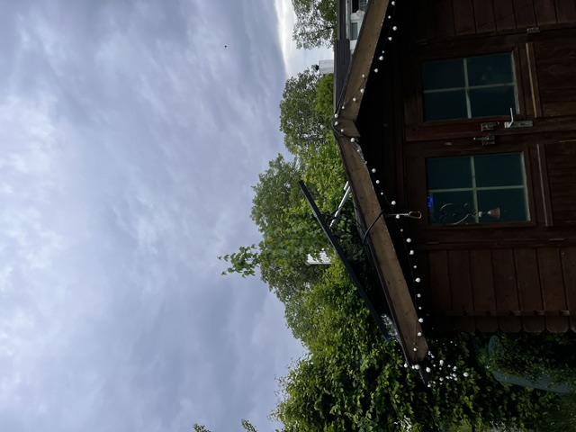
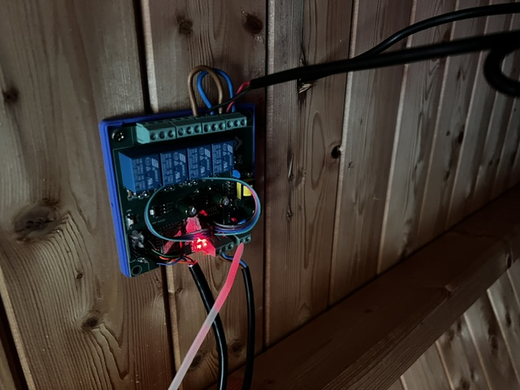
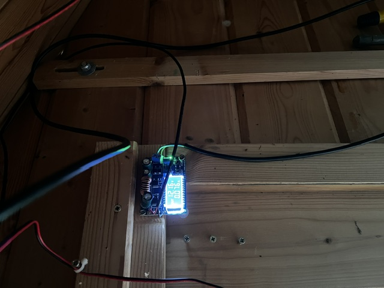
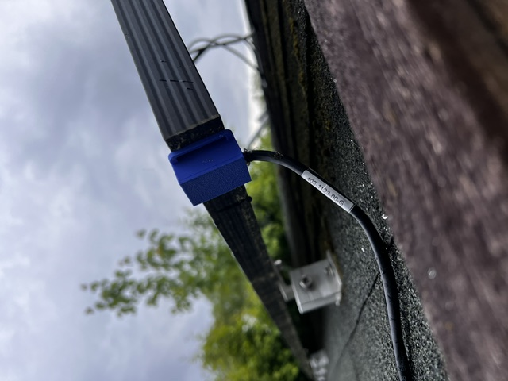

# FollowMySun

> **Astronomisch geführte Sonnenstand-Nachführung für ein einzelnes PV-Modul auf einem Gartenhaus-Dach.** Basierend auf ESP8266 (ESP12F-Relay-X4), MPU-6050-Beschleunigungssensor und einem 12 V Linear-Aktuator – mit MQTT-Anbindung an Home Assistant inkl. Sturm-Notfallmodus.

---

## Inhalt

- [Was macht das System?](#was-macht-das-system)
- [Features](#features)
- [Hardware-Aufbau](docs/hardware.html)
- [Installation Schritt-für-Schritt](docs/installation.html)
- [MQTT-Integration für Home Assistant](docs/mqtt.html)
- [NodeRED-Sturmwarnung-Flow](docs/nodered-stormwatch.html)
- [Sensor-Kalibrierung](docs/calibration.html)
- [Software-Architektur](docs/software.html)
- [Hardware-Migration ESP12F → Olimex ESP32-EVB-EA](docs/hardware-migration-esp32-evb.html) — Umbau für WLAN-schwache Standorte, externe Antenne, korrekter 12 V-Split
- [Wiring-Übersicht ESP32-EVB](docs/wiring-esp32-evb.html) — alle vier Schaltbilder auf einer Seite, als Werkbank-Referenz
- [Source-Code auf GitHub](https://github.com/icepaule/followmysun)

## Was macht das System?

Ein einzelnes PV-Modul auf dem 32°-Dach eines Gartenhauses wird durch einen 12 V Linear-Aktuator zwischen 32° (flach auf dem Dach) und ca. 59° (Aktuator voll ausgefahren) verstellt. Ein MicroPython-Programm auf einem ESP12F berechnet aus Datum, Uhrzeit und Standort den optimalen Panel-Winkel zur Sonne, misst per MPU-6050-Beschleunigungssensor den aktuellen Ist-Winkel und steuert über zwei Relais die Polarität am Aktuator.

Alle Werte werden per MQTT an einen Broker geschickt – damit baut sich in Home Assistant ein Live-Dashboard. Über ein Command-Topic (`cmnd/solar/EMERGENCY = on`) lässt sich das Panel bei Unwetterwarnung sofort flach auf das Dach fahren.

## Features

- **Astronomische Sonnenstand-Berechnung** für jeden Tag des Jahres und jede Tageszeit
- **MPU-6050-Regelung** mit asymmetrischer Hysterese (Start ab 2° Abweichung, Stopp ab 0,5° + Overshoot-Erkennung)
- **MQTT** mit JSON-Vollpayload + einzelnen Topics für Home-Assistant-Sensoren
- **Notfallmodus** über MQTT (`cmnd/solar/EMERGENCY`) – Panel sofort in Schutzposition
- **Hardware-Watchdog** (~3 s) gegen ESP-Hänger
- **WebREPL** zur Wartung übers WLAN (kein USB nötig nach Einbau)
- **Mini-Webserver** zur manuellen Steuerung im Browser
- **Kalibrierungs-Layer** mit Offset/Sign – Sensor-Achsenrichtung muss nicht physisch perfekt sitzen

## Hardware-Bilder

<table>
  <tr>
    <td style="vertical-align:top;padding:8px;">
      
      
<b>Controller</b> – ESP12F-Relay-X4 im Gartenhaus-Inneren

    </td>
    <td style="vertical-align:top;padding:8px;">
      
      
<b>Stromversorgung</b> – 12 V → 5 V Stepdown-Wandler mit Display

    </td>
  </tr>
  <tr>
    <td style="vertical-align:top;padding:8px;">
      
      
<b>MPU-6050</b> – im 3D-Druck-Gehäuse direkt am Panel-Rahmen

    </td>
    <td style="vertical-align:top;padding:8px;">
      
      
<b>Gesamtansicht</b> – Panel über dem Dachfirst

    </td>
  </tr>
</table>

## Schnellstart

1. Hardware nach Pinbelegung verdrahten ([hardware.html](docs/hardware.html))
2. MicroPython auf ESP12F flashen ([installation.html](docs/installation.html))
3. `src/env.example.py` nach `env.py` kopieren und Werte einfüllen
4. Code zu `.mpy` kompilieren: `python -m mpy_cross solar_main.py`
5. Dateien hochladen (USB oder WebREPL)
6. Strom an – fertig

## Tech-Stack

MicroPython 1.28 · ESP8266 (ESP12F) · MPU-6050 GY-521 · 12 V Linear-Aktuator · mosquitto/paho-mqtt · Home Assistant · Node-RED

## Lizenz

MIT — siehe [LICENSE auf GitHub](https://github.com/icepaule/followmysun/blob/main/LICENSE).
